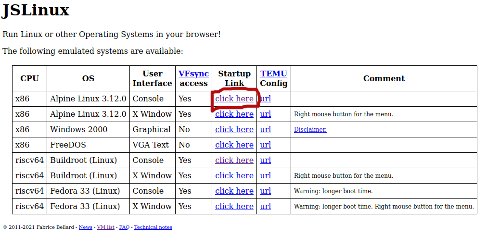
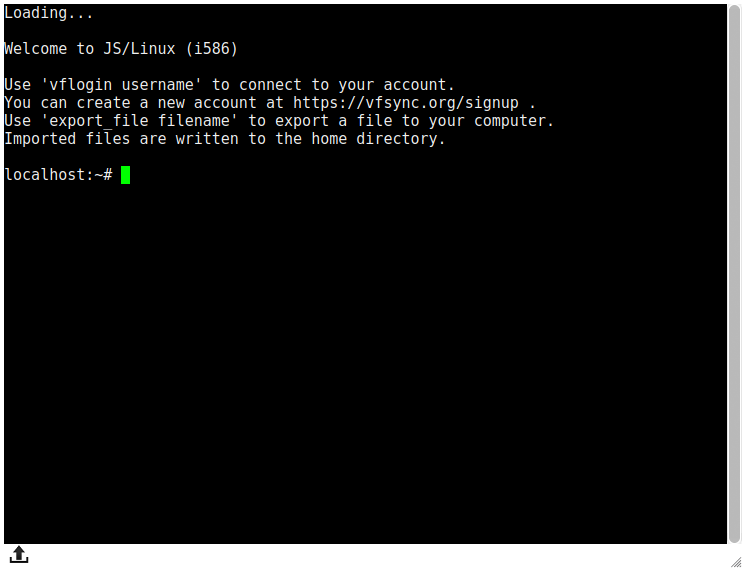
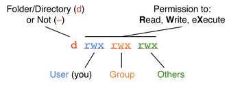
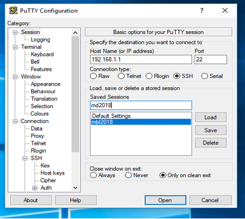

# Basics of the Linux Command Line
#### Whitney England - Microbial Diversity 2023

## Getting Started

Today, we'll be using JSLinux, a web-based terminal emulator, to practice commands in a UNIX environment. Access it here: https://bellard.org/jslinux/.

You'll be presented with a list of options; click "click here" under "Startup Link" in the first row (Alpine Linux 3.12.0).




## What is this?

A terminal - a window that allows you to interact with a remote computer via text-based commands. The `localhost:~#` is called the prompt - this will look different depending on the computer you're logged into, but generally, the first part will tell you the name of the server you're logged into, followed by the directory you're currently in, then ending with # or $.  After the prompt, you can type your commands.  Hit Enter to run them.




## Where am I?

By default, you'll be in your home directory.  The `pwd` command will **print** the current **working directory**, telling you where you are.  Usually, this will be something like `/home/yourname`


```bash
pwd
```

You can also establish who you are (your username).


```bash
whoami
```

To see the files and directories present in your current directory, use the `ls` command.


```bash
ls
```

You can get more detail on the files using `ls -l`.


```bash
ls -l
```

There are lots of other ways to customize the output of `ls`.  You can use the `man` command to get a **man**ual for another command. *This won't work in our practice terminal, but it will on most systems.*


```bash
man ls
```

Now you can try something more complex.


```bash
ls -lah
```

## File permissions
So what's all this `drwxrwxr-x`?  These are permissions, which tell you what you (and others) can do to a file or directory.




## Files and directories

You can create new directories, move to them, and see what's inside.

_Avoid using these characters in file or directory names:_ ``| , ! @ # $ % ^ & * ( ) { } [ ] + = ; : \ ` ? > < space tab``. `_` and `-` are good substitutes for spaces.


```bash
mkdir awesome_data
```


```bash
ls
```


```bash
cd awesome_data
```

*Note how your prompt changes as you move to a new directory.*


```bash
ls
```

You can move to a directory above your current one using a double dot (`..`).


```bash
cd ..
```


```bash
pwd
```

You can chain together as many double dots as you like.  This would take you up three directory levels: `../../..`.

Another useful shortcut is `~`, which represents your home directory.


```bash
cd ~
```


```bash
pwd
```

We can also create simple text files.


```bash
echo "some fun text" > myfile.txt
```


```bash
ls
```

We can show the entire file with `cat`, scroll through it with `less`, or edit it with `nano`.


```bash
cat myfile.txt
```


```bash
less myfile.txt
```

Type `q` to quit.


```bash
nano myfile.txt
```

`Ctrl+x` to exit, `y`/`n` to save or not save the file.

Files and directories can be copied, moved, and removed.  _There is no recycle bin here; if you delete something, it's gone forever. Remove with care._


```bash
cp myfile.txt newfile.txt
```


```bash
mv newfile.txt awesome_data
```


```bash
cd awesome_data
```


```bash
mv newfile.txt delete_this.txt
```


```bash
rm delete_this.txt
```


```bash
cd ~
```

To delete directories and their contents **recursively**, use the `-r` flag.


```bash
rm -r awesome_data
```

## Searching

We can use `grep` to search within text files.  Move back to your home directory and try searching `myfile.txt`.


```bash
grep "fun" myfile.txt
```

To find a file, use the `find` command. `~` is the directory to search (recursively), `-iname` searches by name, case-insensitive, and `"myfile.txt"` is the name to search for. `man find` will get you more details.


```bash
find ~ -iname "myfile.txt"
```

## Ending Things

You can kill a running command with `Ctrl+C`.

_Hint: you can paste this into the practice terminal by right-clicking on the flashing green cursor._


```bash
while :; do echo 'OH NO'; sleep 1; done
```

To terminate your connection to a server, use `Ctrl+D`.

## Other useful tips

You can use the mouse to select and copy text, but not to move your cursor.  Use the left and right arrow keys to move around.

Copy and paste are a little different than you're used to - `Ctrl+Shift+C` and `Ctrl+Shift+V`.

You can use the up and down arrows to scroll through your command history - useful for editing previous commands.

You can use tab to autocomplete commands and filenames - type the beginning of the file name and then hit tab.  Hit it twice to see a list of options if there's more than one possibility.

Asterisks (\*) are wildcard characters.  For example, this would list all files in the current directory ending in .txt: `ls *.txt`

If a text file is behaving strangely, the problem may be linebreaks. Windows, Mac, and Linux operating systems use different characters to tell a file the line has ended:  `\r\n` , `\r`, `\n`, `^M`.  Use a decent text editor than can produce Unix linebreaks (not Notepad, never MS Word!).  `nano` will work perfectly. Notepad++ is good for Windows users.  You can fix incorrect linebreaks using the commands `dos2unix` and `mac2unix`.

You can see which directories will be searched when executing programs by examining your PATH variable: `echo "$PATH"`

 ## Logging in using a real terminal
 ### Mac/ Linux

You're using a UNIX-like system, so login using your local terminal using ssh (**s**ecure **sh**ell).  The command will look something like this:

`ssh your_username@server_address`

Enter your password when prompted and hit Enter.

If you need to view graphics from the server, add -X or -Y.  This can be finicky, so if one doesn't work, try the other.

`ssh -X your_username@server_address` or `ssh -Y your_username@server_address`

For our current course server, you'll use a private key file (.pem) to prove your identity instead of a password:

`ssh -i "your_username_md2023.pem" your_username@18.222.38.194`

For IU servers:

`ssh your_username@quartz.uits.iu.edu`

OR

`ssh your_username@carbonate.uits.iu.edu`

You'll need to complete 2-factor authentication with Duo to complete your login.

### Windows (using PuTTY)

For the course server:

1. Open PuTTY
2. Under Category, click on SSH > Auth
3. Click browse
4. Find your private key (your_username_md2023.pem) and select it
5. Under Category, click on SSH > Auth and check the "Enable X11 forwarding" box.
6. Under Category, click Session and input the server IP address (**18.222.38.194**) in the "host name" box
7. Type "md2023" in the box under saved sessions and click save.
8. Double-click on the "md2023" that appears under saved sessions.
9. Log in with your username. Your key should be used automatically.
10. For future logins, just double-click the "md2023" saved session.

For the IU servers:

1. Open PuTTY
2. If you need to view graphics from the server: Under Category, click on SSH > Auth and check the "Enable X11 forwarding" box.
3. Under Category, click Session and input the server address (`quartz.uits.iu.edu` or `carbonate.uits.iu.edu`) in the "host name" box     
4. Type "md2023_quartz" or "md2023_carbonate" in the box under saved sessions and click save. 
5. Double-click on the "md2023_quartz" or "md2023_carbonate" that appears under saved sessions.
6. Log in with your username and password.
7. You'll need to complete 2-factor authentication with Duo to complete your login.
8. For future logins, just double-click the "md2023_quartz" or "md2023_carbonate" saved session.





## Submitting jobs in a cluster environment with Slurm
### Batch scripts

Both quartz and carbonate are computing _clusters_ made up of many individual computers, or _nodes_.  Lots of people are constantly running lots of demanding programs, so we need a way to make sure everyone's jobs are managed fairly.  Enter SLURM.  SLURM is a scheduler that will add your job to a queue; it will run on an appropriate node when it's its turn.

To run anything other than basic commands, you'll need to create a script - a text file with some header lines that tells SLURM details about the job you want to run, followed by the commands themselves. Here's an example:

```
#!/bin/bash

#SBATCH --job-name=your_job_name      ## Name of the job.
#SBATCH --nodes=1            ## (-N) number of nodes to use
#SBATCH --ntasks=1           ## (-n) number of tasks to launch. Typically 1 unless you're getting fancy.
#SBATCH --cpus-per-task=4    ## number of cores the job needs
#SBATCH --error=%x-%j.err ## error log file.  %x is replaced by numeric job ID, %j is job name as above
#SBATCH --out=%x-%j.out ## out log file.  %x and %j same as with --error
#SBATCH --mail-type=fail,invalid_depend,begin,end   ##emails you if the job starts, ends, fails, or can't start due to invalid dependencies. optional.
#SBATCH --mail-user=your.email@wherever.edu  ##replace with your email. optional.
#SBATCH --time=1-02:03:04 ## Format is DD-HH-MM-SS - this job would time out at 1 day, 2 hours, 3 minutes, 4 seconds. optional, but choosing a shorter time will likely get your job running sooner.
#SBATCH --mem=8G ##maximum memory usage.  technically optional but recommended.
#SBATCH -A slurm-account-name   ##Name of SLURM account to charge.
#SBATCH -p some_partition   ##Name of partition to run on

module load prokka

prokka --cpus 4 --outdir my_prokka_results --prefix my_genome --metagenome --kingdom archaea my_seq.fa
```


Let's break that down.

`#!/bin/bash` denotes which _shell_ you're using. Shells are what actually provide the command line interface. Most linux systems use bash. If you're on a mac, you may be using zsh. On quartz, carbonate, and most linux systems, we want bash.

Lines starting with `#SBATCH` are instructions to SLURM. They are used to set the name of your job, the amount of nodes, CPUs, and memory required for your job, where to send error and output logs, where to send an email if your job changes status, and more. The comments (`##`) above explain what each line does. It's to your advantage to request reasonable resources for your job - smaller requests are more likely to get run sooner in the queue, and you won't take up unnecessary resources that other users could have used.

The account (-A) and partition (-p) will be specific to the cluster you're using, if they are required at all.

Software is often installed as _modules_ on clusters.  You can load just the modules required for your job, which helps avoid conflicts between software packages.  In this case, I was running prokka, so I activated that module with `module load prokka`.  

To see what modules are available, run `module avail`.  

To see what modules are currently loaded, `module list`. 

To deactivate a module, `module unload module_name`.

Finally, after all the setup, I can run my actual prokka command.

_HOT TIP:_ Save this example and use it as a template when creating new job scripts.

### Running your jobs

To submit your script to the queue, use the command `qsub`:

`qsub myscript.slurm`

To check the status of your jobs, use the `squeue` command:

`squeue -u your_username`

You should see something like this:

      JOBID     USER      ACCOUNT           NAME  ST  TIME_LEFT NODES CPUS TRES_PER_N MIN_MEM NODELIST (REASON) 
      6663845 my_username some_acct job_name_1   R   14:13:50     1    8        N/A     32G node1 (None) 
      6663849 my_username some_acct job_name_2   R   14:13:50     1    4        N/A     16G node2 (None) 
      
JOBID: numerical job ID

USER: you

ACCOUNT: jobs are typically assigned to a specific account if you're on a cluster that tracks or bills for usage.

NAME: job name

ST: Job state.  Some common states are:
  * PD: pending (waiting its turn)
  * R: running
  * F: failed
  * CG: completing (in the process of finishing; nearly done)
  * CD: completed
  * OOM: out of memory
  * TO: timeout (job reached time limit)
  
TIME_LEFT: remaining time until job reaches time limit

NODES: Number of nodes used

CPUs: Number of CPUs used

TRES_PER_N: Refers to **T**rackable **RES**ources - you won't need to worry about this.

MIN_MEM: Memory you requested for your job

NODELIST: Names of node(s) being used by your job

REASON: Explains reasons for job state.  If your job is running normally, this will be (None).  If something has gone wrong, this may be helpful in figuring out why.

Once your job has completed, it will disappear from the queue.  By default, jobs run in the directory you submitted the job from - look there for your output files.

If you need to cancel a job, use the `scancel` command.  To cancel the first job above:

`scancel 6663845`


### Interactive sessions

If you need to run a job interactively, rather than submitting a batch script, you can start an interactive session:

`srun -p some-partition -A slurm-account-name --pty bash`

This will open an interactive bash terminal.  Make sure to end the session when you're done - `Ctrl+D` will disconnect you.

### More info

IU's Slurm help page is here: https://kb.iu.edu/d/awrz
